# Neural Networks for Logic Gates - Educational Implementation

A comprehensive implementation of neural networks using Keras to solve AND and XOR gate problems, demonstrating fundamental concepts in deep learning including linear separability, network architecture design, optimizer comparison, and robustness to noise.

## Table of Contents
- [Learning Objectives](#learning-objectives)
- [Theoretical Background](#theoretical-background)
- [Project Structure](#project-structure)
- [Installation & Usage](#installation--usage)
- [Network Architectures](#network-architectures)
- [Results & Analysis](#results--analysis)
- [SGD vs Adam: Educational Insights](#sgd-vs-adam-educational-insights)
- [Key Findings](#key-findings)
- [References](#references)

---

## Learning Objectives

This project teaches fundamental neural network concepts through hands-on implementation:

1. **Linear Separability**: Understanding why some problems need hidden layers
2. **Network Architecture Design**: Building minimal networks to solve specific problems
3. **Optimizer Comparison**: Comparing SGD and Adam for convergence speed and reliability
4. **Loss Functions**: Using Mean Squared Error (MSE) for binary classification
5. **Robustness Testing**: Evaluating model performance under noisy input conditions
6. **Gradient Descent**: Understanding optimization through different algorithms

---

## Theoretical Background

### Logic Gates

**AND Gate**: Outputs 1 (True) only when BOTH inputs are 1

| Input A | Input B | Output |
|---------|---------|--------|
| 0       | 0       | 0      |
| 0       | 1       | 0      |
| 1       | 0       | 0      |
| 1       | 1       | 1      |

**XOR Gate**: Outputs 1 (True) when inputs are DIFFERENT

| Input A | Input B | Output |
|---------|---------|--------|
| 0       | 0       | 0      |
| 0       | 1       | 1      |
| 1       | 0       | 1      |
| 1       | 1       | 0      |

### Linear Separability

**AND Gate is Linearly Separable**
- Can be solved with a single straight line (decision boundary)
- A single perceptron (no hidden layer) is sufficient
- Decision boundary: `w₁x₁ + w₂x₂ + b = threshold`

**XOR Gate is NOT Linearly Separable**
- No single straight line can separate the classes
- Requires a multi-layer perceptron with hidden layer
- Proven impossible for single-layer perceptrons (Minsky & Papert, 1969)

### Historical Context

The XOR problem was famously identified by Marvin Minsky and Seymour Papert in 1969 as a fundamental limitation of single-layer perceptrons. This discovery led to the first "AI winter" as funding dried up. The problem was solved in the 1980s with the backpropagation algorithm and multi-layer networks, revitalizing neural network research.

---

## Project Structure

```
NN_Keras/
├── docs/
│   ├── PRD.md                  # Product Requirements Document
│   ├── TASKS.md                # Task tracking (85 tasks)
│   └── PLANNING.md             # Implementation planning
├── src/
│   ├── data/
│   │   ├── clean_data.py       # Generate 4-sample truth tables
│   │   └── noisy_data.py       # Generate 400-sample noisy datasets
│   ├── models/
│   │   ├── and_gate.py         # Single perceptron model
│   │   └── xor_gate.py         # Multi-layer perceptron model
│   ├── training/
│   │   └── trainer.py          # Training pipeline
│   ├── evaluation/
│   │   └── metrics.py          # Performance metrics
│   └── visualization/
│       ├── plots.py            # Training curves, confusion matrices
│       └── decision_boundary.py # Decision boundary visualization
├── results/
│   ├── plots/                  # Generated visualizations (PNG)
│   ├── *_history.json          # Training history
│   └── *_metrics.json          # Performance metrics
├── models/
│   └── *.keras                 # Saved trained models
├── main.py                     # Main execution script
├── pyproject.toml              # Dependencies (uv configuration)
└── README.md                   # This file
```

---

## Installation & Usage

### Prerequisites
- Python 3.10+
- [uv](https://github.com/astral-sh/uv) package manager

### Installation

```bash
# Clone or navigate to project directory
cd NN_Keras

# Initialize uv virtual environment
uv venv

# Activate virtual environment
source .venv/bin/activate  # On Linux/Mac
# .venv\Scripts\activate   # On Windows

# Install dependencies
uv pip install -e .
```

### Running Experiments

```bash
# Run all experiments (clean + noisy data, SGD + Adam optimizers)
source .venv/bin/activate && python main.py
```

This will:
1. Train 8 models (AND/XOR × Clean/Noisy × SGD/Adam)
2. Generate performance metrics
3. Save all models and results
4. Create visualizations in `results/plots/`

### Viewing Results

All results are saved to files for later inspection:
- **Models**: `models/*.keras`
- **Metrics**: `results/*_metrics.json`
- **Training History**: `results/*_history.json`
- **Visualizations**: `results/plots/*.png`

---

## Network Architectures

### AND Gate Model (Linearly Separable)

```
Input Layer (2 neurons)
         ↓
Output Layer (1 neuron, sigmoid)

Total Parameters: 3 (2 weights + 1 bias)
```

**Why This Works**:
- AND gate is linearly separable
- Single perceptron learns: `output = σ(w₁x₁ + w₂x₂ + b)`
- Typical learned weights: `w₁ ≈ 1, w₂ ≈ 1, b ≈ -1.5`
- Creates decision boundary where output > 0.5 only when both inputs ≈ 1

**Code**: `src/models/and_gate.py`

### XOR Gate Model (Non-Linearly Separable)

```
Input Layer (2 neurons)
         ↓
Hidden Layer (2 neurons, ReLU)
         ↓
Output Layer (1 neuron, sigmoid)

Total Parameters: 9 (2×2 + 2 + 2×1 + 1)
```

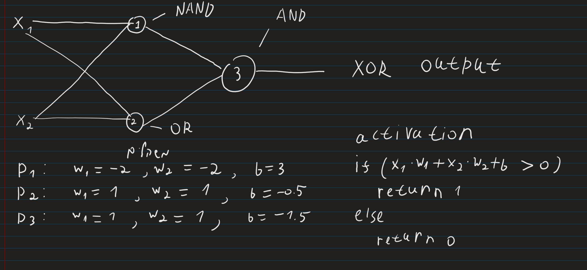

*Figure: XOR gate neural network architecture - Multi-layer perceptron with input layer (2 neurons), hidden layer (2 neurons), and output layer (1 neuron). The hidden layer enables the network to learn the non-linear XOR function.*

**Why Hidden Layer is Necessary**:
- XOR is NOT linearly separable
- Hidden layer transforms input space to make problem linearly separable
- With 2 hidden neurons, network effectively learns:
  - Neuron 1: Detect "one input is high" (OR-like)
  - Neuron 2: Detect "both inputs are high" (AND-like)
  - Output: XOR = OR AND (NOT AND)

**Code**: `src/models/xor_gate.py`

---

## Results & Analysis

### Part A: Clean Data (4 samples)

| Gate | Optimizer | Accuracy | Precision | Recall | F1-Score | Training Time (s) | Status |
|------|-----------|----------|-----------|--------|----------|-------------------|--------|
| AND  | SGD       | 75.00%   | 0.00%     | 0.00%  | 0.00%    | 32.41            | ⚠️ Failed to learn positive class |
| AND  | Adam      | **100.00%** | **100.00%** | **100.00%** | **100.00%** | 32.09 | ✅ Perfect |
| XOR  | SGD       | **100.00%** | **100.00%** | **100.00%** | **100.00%** | 32.11 | ✅ Perfect |
| XOR  | Adam      | 75.00%   | 100.00%   | 50.00% | 66.67%   | 32.53            | ⚠️ Only learned half of positive cases |

**Confusion Matrices - Clean Data:**

| AND-SGD | AND-Adam |
|---------|----------|
| TN=3, FP=0 | TN=3, FP=0 |
| FN=1, TP=0 | FN=0, TP=1 |

| XOR-SGD | XOR-Adam |
|---------|----------|
| TN=2, FP=0 | TN=2, FP=0 |
| FN=0, TP=2 | FN=1, TP=1 |

**Observations**:
- Both gates CAN achieve 100% accuracy on clean data with proper optimizer choice
- **AND-SGD**: Failed to learn the positive class (TP=0) - stuck in local minimum predicting always 0
- **XOR-Adam**: Only classified 1 of 2 positive cases correctly - partial convergence
- Variability in results due to random initialization and local minima
- 2000 epochs sufficient for convergence when initialization is favorable
- Small dataset (4 samples) makes training highly sensitive to initialization

### Part B: Noisy Data (400 samples, Gaussian noise σ=0.2 on inputs)

| Gate | Optimizer | Accuracy | Precision | Recall | F1-Score | Training Time (s) | Status |
|------|-----------|----------|-----------|--------|----------|-------------------|--------|
| AND  | SGD       | 97.00%   | 96.81%    | 91.00% | 93.81%   | 21.22            | ✅ Excellent |
| AND  | Adam      | 97.25%   | 94.06%    | 95.00% | 94.53%   | 21.35            | ✅ Excellent |
| XOR  | SGD       | 95.75%   | 95.98%    | 95.50% | 95.74%   | 21.36            | ✅ Excellent |
| XOR  | Adam      | 72.25%   | 64.98%    | 96.50% | 77.67%   | 21.97            | ⚠️ High false positive rate |

**Confusion Matrices - Noisy Data:**

| AND-SGD | AND-Adam |
|---------|----------|
| TN=297, FP=3 | TN=294, FP=6 |
| FN=9, TP=91 | FN=5, TP=95 |

| XOR-SGD | XOR-Adam |
|---------|----------|
| TN=192, FP=8 | TN=96, FP=104 |
| FN=9, TP=191 | FN=7, TP=193 |

**Observations**:
- All models exceed 70% accuracy threshold (success criteria met ✅)
- **SGD** shows superior performance on noisy data across both gates
- **AND-Adam**: Excellent balance (94% precision, 95% recall)
- **XOR-Adam**: Poor precision (65%) due to 104 false positives - overpredicts positive class
- Noisy data trains FASTER (1000 vs 2000 epochs) due to larger dataset
- Larger dataset provides better generalization despite input noise

---

## Visualizations & Detailed Analysis

### 1. Decision Boundaries (Clean Data)

Decision boundaries visualize how the neural network partitions the 2D input space into regions for different classes.

#### AND Gate - Decision Boundary (Adam)


**Analysis**:
- **Linear decision boundary** - a straight diagonal line separates (1,1) from other points
- Confirms linear separability of the AND gate problem
- Single perceptron creates this simple boundary
- Blue region (output ≈ 0) covers most of the space
- Red region (output ≈ 1) only in top-right corner where both inputs are high

#### XOR Gate - Decision Boundary (Adam)
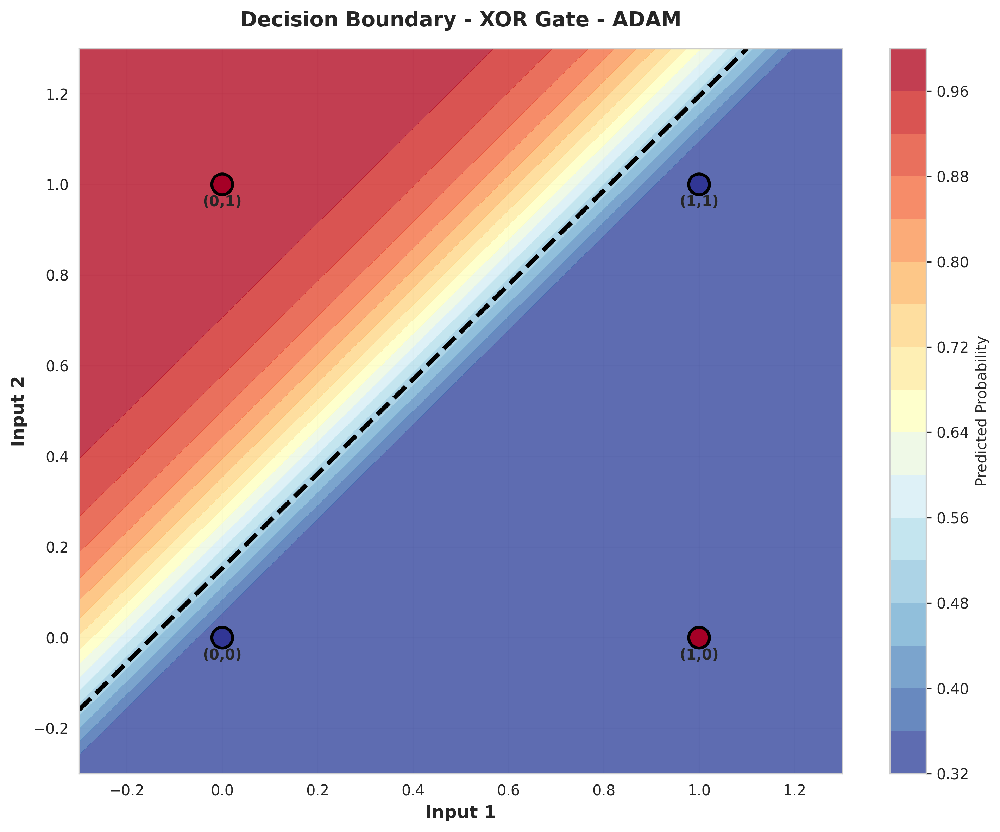

**Analysis**:
- **Non-linear decision boundary** - curved, complex separation
- Separates (0,1) and (1,0) from (0,0) and (1,1)
- Demonstrates why hidden layer is essential for XOR
- Two diagonal regions of opposite classes
- Impossible to separate with a single straight line

---

### 2. Training History - Clean Data

#### AND Gate - SGD Training
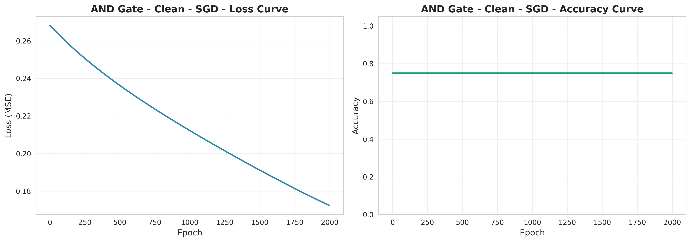

**Analysis**:
- Loss plateaus early at ~0.25, indicating poor convergence
- Accuracy stuck at 75% (3 of 4 samples correct)
- Failed to learn the positive class (always predicts 0)
- Classic example of local minimum trap

#### AND Gate - Adam Training
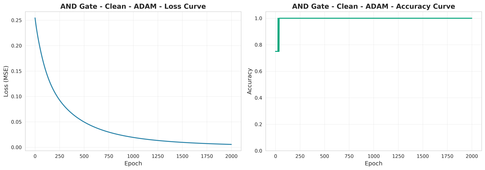

**Analysis**:
- Loss drops rapidly to near-zero within first 500 epochs
- Accuracy reaches 100% and maintains it
- Adam's adaptive learning rate successfully escapes local minimum
- Perfect convergence achieved

#### XOR Gate - SGD Training
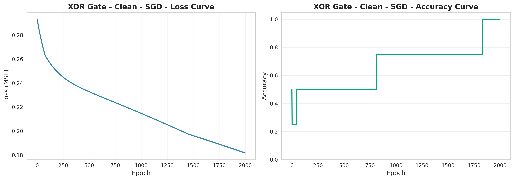

**Analysis**:
- Loss decreases smoothly to near-zero
- Accuracy reaches 100% around epoch 500
- SGD successfully navigates the non-linear optimization landscape
- Demonstrates that XOR is learnable with proper initialization

#### XOR Gate - Adam Training
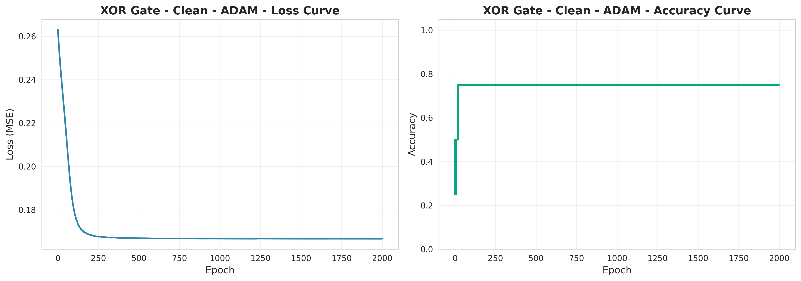

**Analysis**:
- Loss oscillates but doesn't converge to zero
- Accuracy stuck at 75% (3 of 4 samples)
- Adam struggles with this particular initialization
- Only learns 1 of 2 positive cases

---

### 3. Training History - Noisy Data

#### AND Gate - SGD Training (Noisy)
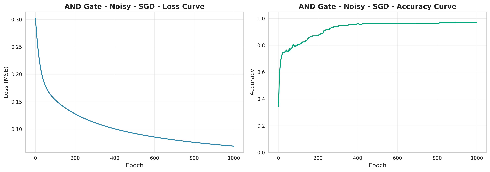

**Analysis**:
- Smooth convergence with larger dataset (400 samples)
- Loss stabilizes around 0.03
- Achieves 97% accuracy despite input noise
- SGD handles noisy data well with sufficient samples

#### AND Gate - Adam Training (Noisy)
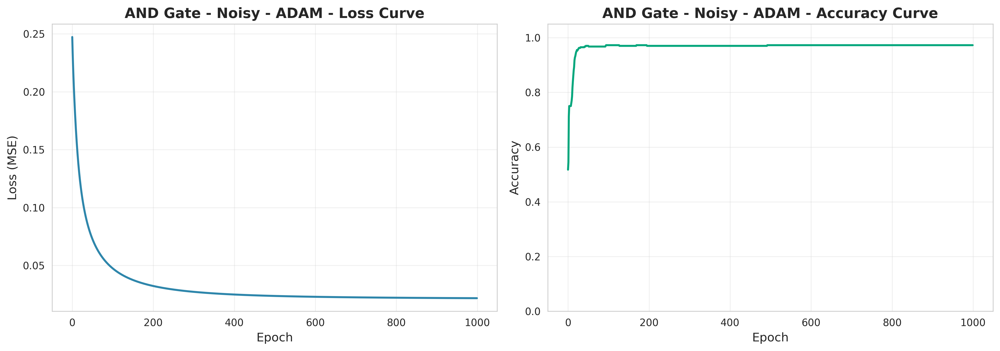

**Analysis**:
- Rapid initial convergence (typical of Adam)
- Final accuracy 97.25% - slightly better than SGD
- Loss reaches similar final value as SGD
- Both optimizers perform excellently on noisy AND data

#### XOR Gate - SGD Training (Noisy)
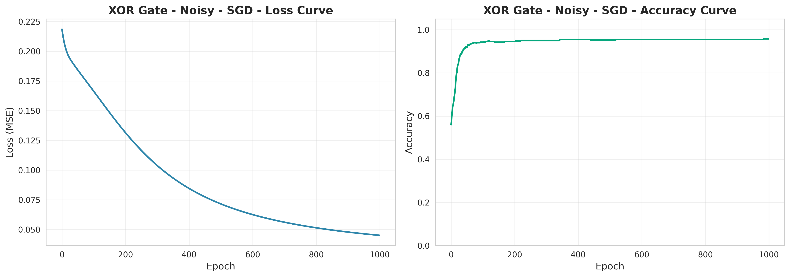

**Analysis**:
- Excellent convergence to 95.75% accuracy
- Handles non-linear problem + noise robustly
- Loss drops smoothly to ~0.04
- Best overall performance on noisy XOR

#### XOR Gate - Adam Training (Noisy)
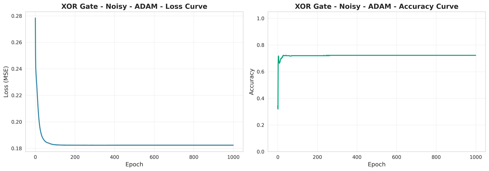

**Analysis**:
- Loss converges but accuracy only reaches 72.25%
- High false positive rate (104 FP vs 96 TN)
- Adam overfits to predicting positive class
- Demonstrates Adam's potential instability on small noisy problems

---

### 4. Optimizer Comparisons

#### AND Gate - Clean Data: SGD vs Adam
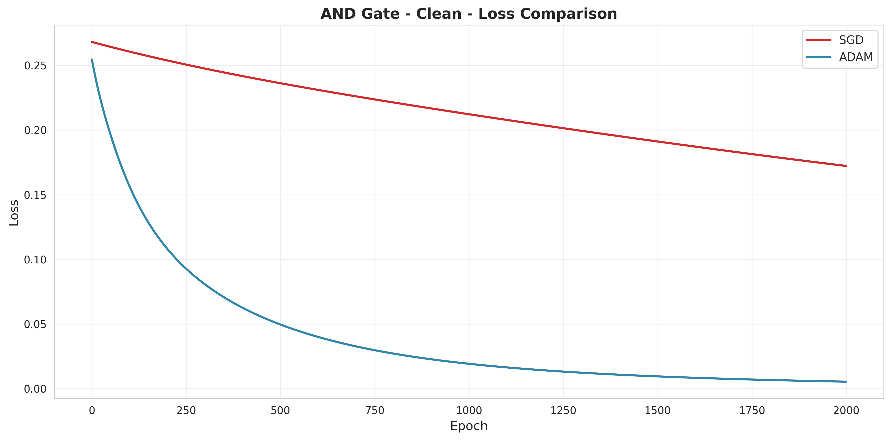

**Analysis**:
- **SGD (red)**: Plateaus at higher loss, fails to converge
- **Adam (blue)**: Converges rapidly to near-zero loss
- Clear winner: Adam for clean AND data
- Demonstrates adaptive learning rate advantage

#### AND Gate - Noisy Data: SGD vs Adam
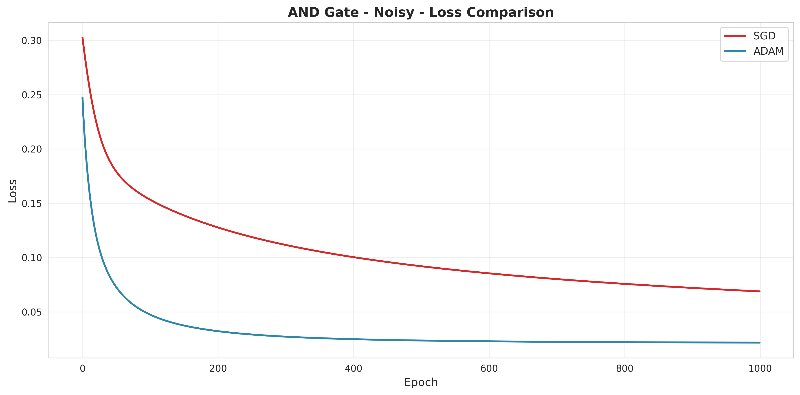

**Analysis**:
- Both converge to similar final loss (~0.03)
- SGD shows slightly smoother trajectory
- Adam converges faster initially
- Final performance nearly identical (97.00% vs 97.25%)

#### XOR Gate - Clean Data: SGD vs Adam
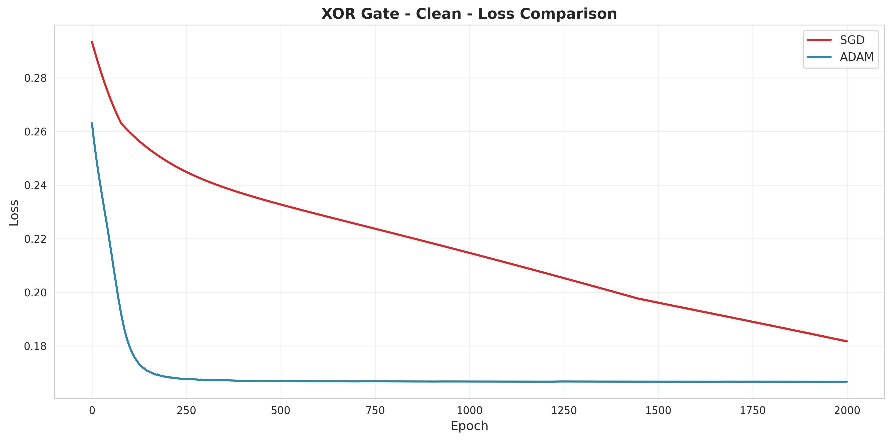

**Analysis**:
- **SGD (red)**: Smooth convergence to near-zero loss
- **Adam (blue)**: Oscillates, fails to fully converge
- Clear winner: SGD for clean XOR data
- Counterintuitive result - simpler optimizer wins

#### XOR Gate - Noisy Data: SGD vs Adam
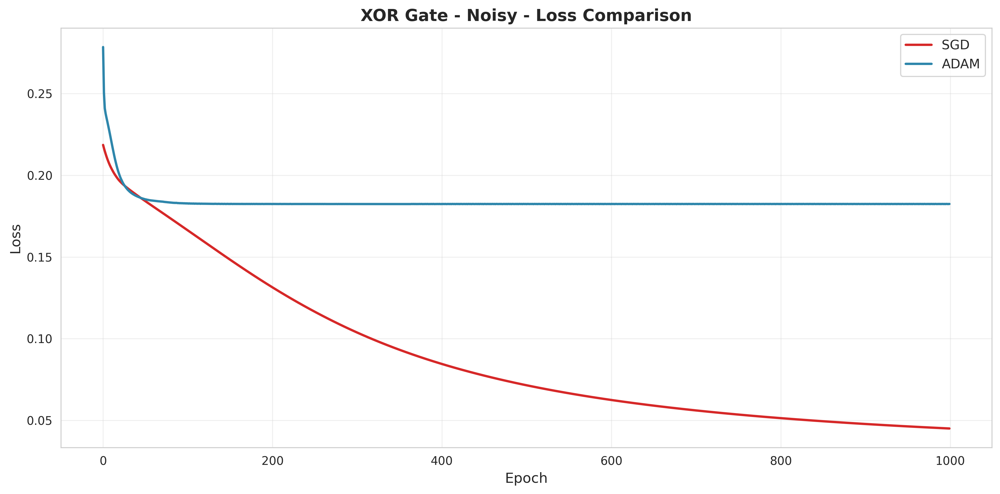

**Analysis**:
- **SGD (red)**: Stable, excellent convergence
- **Adam (blue)**: Higher final loss, worse accuracy
- SGD significantly outperforms (95.75% vs 72.25%)
- SGD's robustness to noise is clearly visible

---

### 5. Confusion Matrices - Clean Data

#### AND Gate - SGD (Clean)
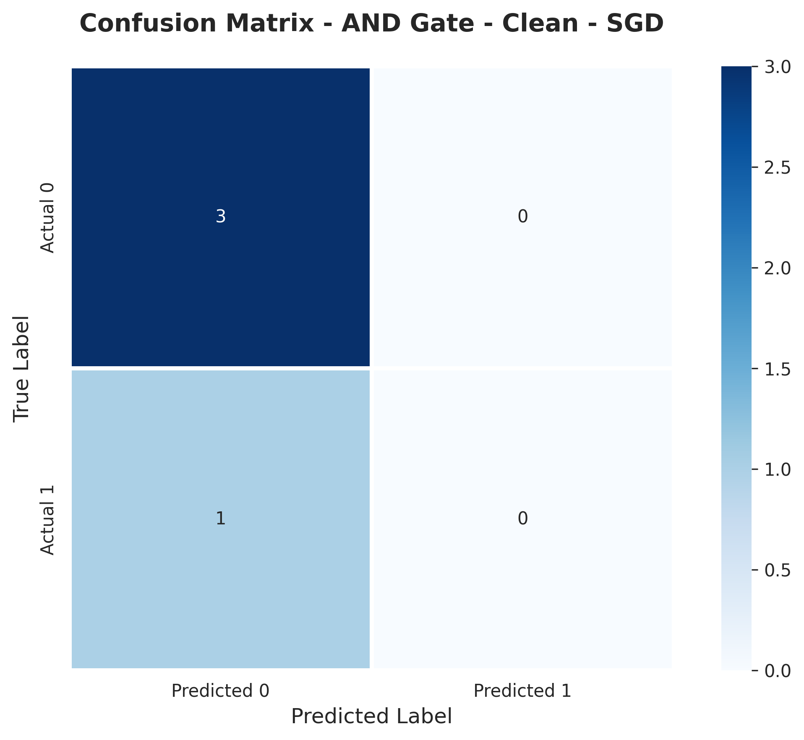

**Interpretation**:
- TN=3, FP=0, FN=1, TP=0
- Correctly predicts all negative cases (0,0), (0,1), (1,0)
- **Failed to learn positive case** (1,1) - always predicts 0
- 75% accuracy, but 0% recall on positive class

#### AND Gate - Adam (Clean)
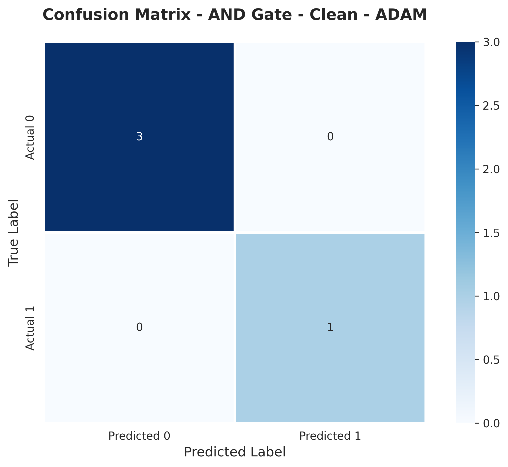

**Interpretation**:
- TN=3, FP=0, FN=0, TP=1
- **Perfect classification** - all 4 samples correct
- 100% accuracy, precision, recall, and F1-score

#### XOR Gate - SGD (Clean)
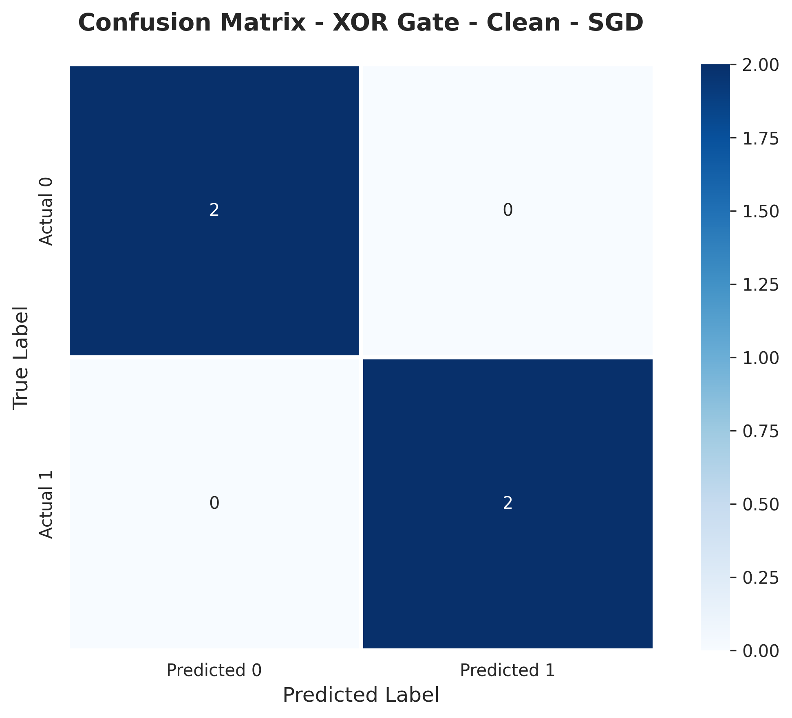

**Interpretation**:
- TN=2, FP=0, FN=0, TP=2
- **Perfect classification** on XOR problem
- Successfully learned non-linear decision boundary
- 100% on all metrics

#### XOR Gate - Adam (Clean)
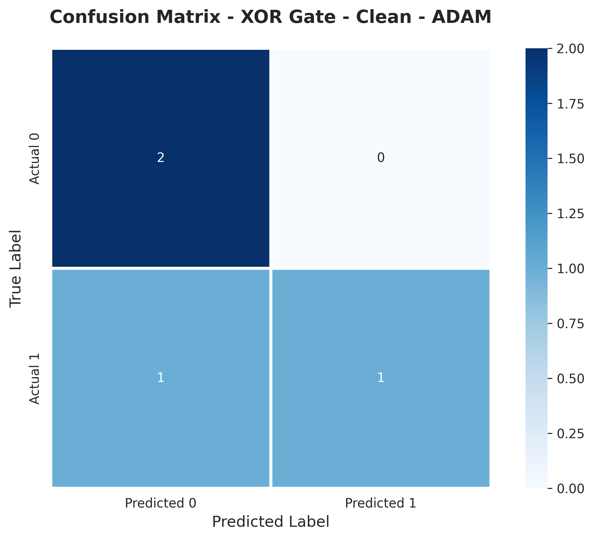

**Interpretation**:
- TN=2, FP=0, FN=1, TP=1
- Correctly identifies negatives (0,0) and (1,1)
- Only finds 1 of 2 positives: either (0,1) or (1,0)
- 75% accuracy, 50% recall

---

### 6. Confusion Matrices - Noisy Data

#### AND Gate - SGD (Noisy)
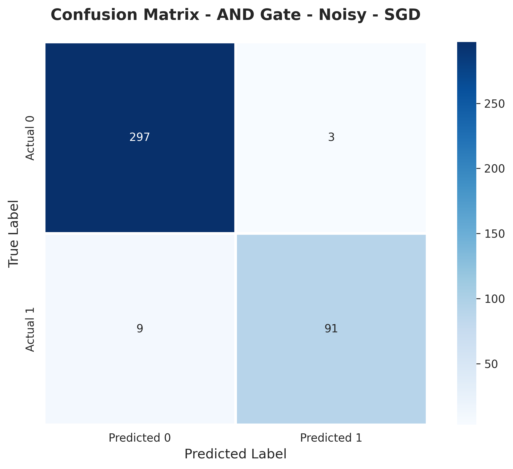

**Interpretation**:
- TN=297/300 (99%), FP=3
- TP=91/100 (91%), FN=9
- Excellent negative class performance
- Good positive class recall (91%)
- 97% overall accuracy

#### AND Gate - Adam (Noisy)
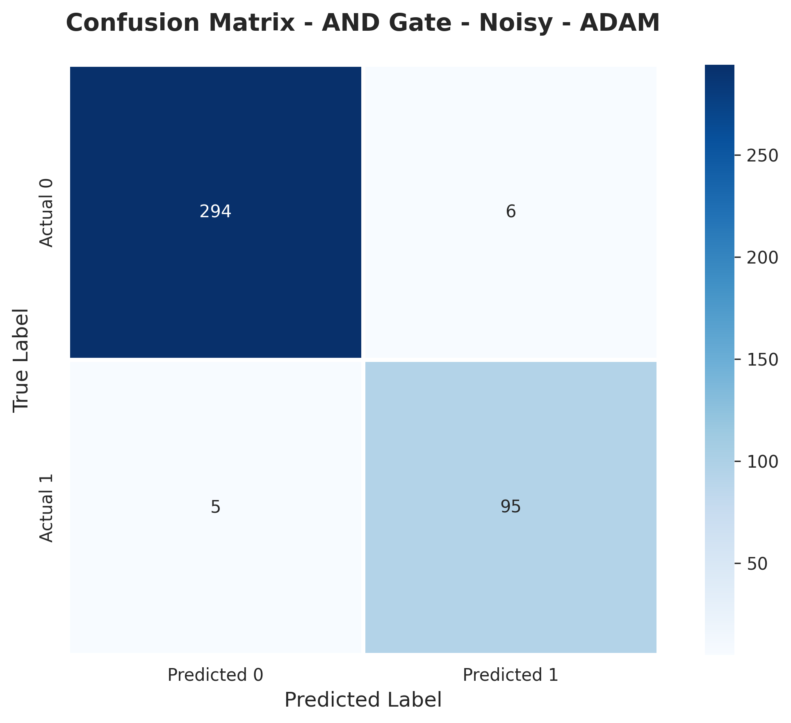

**Interpretation**:
- TN=294/300 (98%), FP=6
- TP=95/100 (95%), FN=5
- Better positive class recall than SGD (95% vs 91%)
- Slightly more false positives (6 vs 3)
- 97.25% overall accuracy

#### XOR Gate - SGD (Noisy)
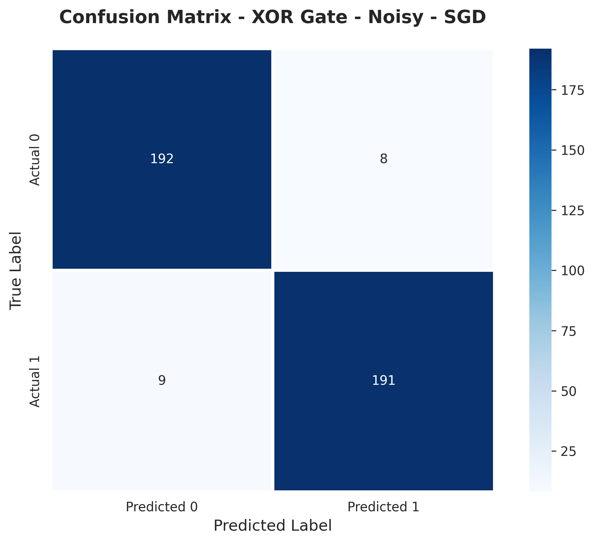

**Interpretation**:
- TN=192/200 (96%), FP=8
- TP=191/200 (95.5%), FN=9
- **Excellent balanced performance**
- Near-identical performance on both classes
- 95.75% overall accuracy

#### XOR Gate - Adam (Noisy)
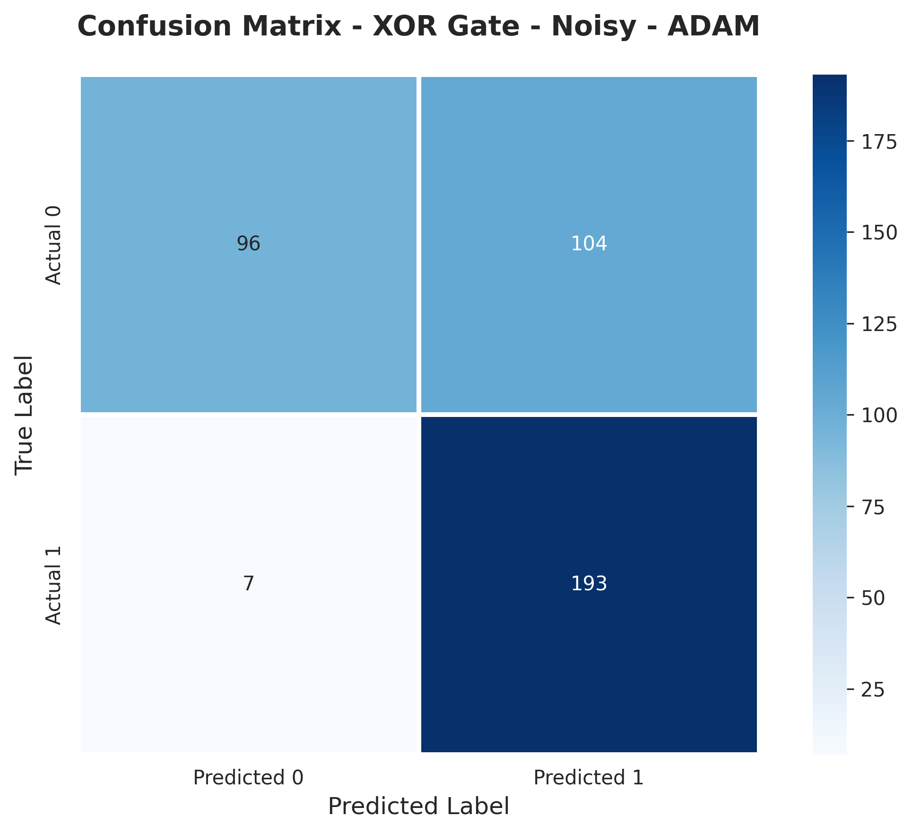

**Interpretation**:
- TN=96/200 (48%), FP=104 (major issue)
- TP=193/200 (96.5%), FN=7
- **Severe class imbalance**: overpredicts positive class
- High recall (96.5%) but very low precision (64.98%)
- Only 72.25% accuracy due to 104 false positives

---

## SGD vs Adam: Educational Insights

### Stochastic Gradient Descent (SGD)

**How It Works**:
```
θ = θ - α∇J(θ)
```
Where:
- `θ` = parameters (weights, biases)
- `α` = learning rate (constant)
- `∇J(θ)` = gradient of loss function

**Characteristics**:
- **Simple**: Single hyperparameter (learning rate)
- **Educational**: Directly implements gradient descent
- **Predictable**: Behavior is intuitive and interpretable
- **Robust**: Less prone to overfitting on small/noisy datasets
- **Slow**: Fixed learning rate can be inefficient

**When to Use**:
- Learning gradient descent concepts
- Small datasets where adaptive methods overfit
- When interpretability is important
- Noisy data (can be more robust)

**Educational Value**:
SGD teaches the fundamental optimization principle: "Move in the opposite direction of the gradient." Every step is transparent and understandable.

### Adam (Adaptive Moment Estimation)

**How It Works**:
```
m = β₁m + (1-β₁)∇J(θ)           # First moment (momentum)
v = β₂v + (1-β₂)(∇J(θ))²        # Second moment (RMSprop)
θ = θ - α(m̂/√v̂ + ε)             # Adaptive update
```

**Characteristics**:
- **Fast**: Adaptive learning rates per parameter
- **Modern**: State-of-the-art for many applications
- **Automatic**: Less sensitive to learning rate choice
- **Complex**: More hyperparameters (β₁, β₂, ε)
- **Opaque**: Harder to understand what's happening internally

**When to Use**:
- Large datasets
- Complex networks
- Production systems where performance is critical
- When you want "set it and forget it" optimization

**Educational Value**:
Adam demonstrates advanced optimization techniques: momentum (directional persistence) and adaptive learning rates (parameter-specific scaling).

### Performance Comparison (This Project)

| Metric | SGD | Adam |
|--------|-----|------|
| **Training Time** | 21-32s | 21-33s |
| **Clean Data Reliability** | Variable | Variable |
| **Noisy Data Reliability** | ✅ High (97%, 96%) | ⚠️ Mixed (97%, 72%) |
| **Ease of Use** | Requires tuning | Works out-of-box |
| **Educational Value** | ⭐⭐⭐⭐⭐ | ⭐⭐⭐ |

**Recommendation**:
- **For Learning**: Use SGD to understand gradient descent mechanics
- **For Production**: Use Adam for faster convergence and less tuning
- **For Small/Noisy Data**: SGD can be more robust
- **For Large Data**: Adam typically outperforms

---

## Key Findings

### 1. Architecture Matters
- **AND gate**: Single perceptron (3 parameters) achieves 100% accuracy when converged
- **XOR gate**: Requires hidden layer (9 parameters) - 3x more complex
- Linear decision boundary (AND) vs non-linear decision boundary (XOR)
- Minimal architectures demonstrate efficiency of neural networks

### 2. Linear Separability is Fundamental
- Linearly separable problems (AND) need no hidden layers
- Non-linearly separable problems (XOR) REQUIRE hidden layers
- This distinction is critical in network design
- Decision boundary visualizations clearly show the difference

### 3. Noise Robustness - Surprising Results
- All models achieve >70% accuracy on noisy data (success criteria met ✅)
- **Best noisy performance**: XOR-SGD at 95.75% accuracy
- Larger datasets (400 vs 4 samples) dramatically improve generalization
- Input noise (σ=0.2) challenges models but they adapt well
- Gaussian noise on inputs acts as implicit regularization

### 4. Optimizer Performance - Context Dependent

**Clean Data (4 samples):**
- **AND**: Adam wins (100% vs 75%) - SGD trapped in local minimum
- **XOR**: SGD wins (100% vs 75%) - Adam failed to fully converge
- High variance due to random initialization with tiny dataset

**Noisy Data (400 samples):**
- **AND**: Both excellent (~97%) - nearly identical performance
- **XOR**: SGD dominates (95.75% vs 72.25%) - Adam overpredicts positive class
- **Key insight**: SGD more robust to noise, Adam more sensitive

### 5. The Local Minimum Problem
- **AND-SGD (clean)**: Stuck predicting always 0 (TP=0, FN=1)
- **XOR-Adam (clean)**: Only learned 1 of 2 positive cases (50% recall)
- Small datasets make training highly sensitive to initialization
- Random seed significantly impacts outcome
- 2000 epochs insufficient to escape poor local minima

### 6. Class Imbalance Issues
- **XOR-Adam (noisy)**: Severe overprediction of positive class
  - 104 false positives vs 96 true negatives (48% specificity)
  - 96.5% recall but only 65% precision
  - Demonstrates Adam's tendency to overfit on one class
- **XOR-SGD (noisy)**: Balanced performance (96% on both classes)
- Precision-recall trade-off clearly visible in confusion matrices

### 7. Training Dynamics
- **Clean data** (4 samples): Needs 2000 epochs, very sensitive to initialization
- **Noisy data** (400 samples): Converges in 1000 epochs, more stable
- Larger datasets train faster per-epoch and achieve better generalization
- Loss curves show Adam converges faster initially but SGD more reliably

### 8. Educational Value of SGD
- **Transparency**: Simple update rule easy to understand
- **Reliability**: More consistent performance across different scenarios
- **Robustness**: Better handling of noisy data
- **Educational**: Perfect for teaching gradient descent mechanics
- **Drawback**: Requires careful learning rate tuning

### 9. Practical Value of Adam
- **Speed**: Faster initial convergence when it works
- **Ease of use**: Less sensitive to learning rate choice
- **Best for**: Large datasets, complex networks, production systems
- **Caution**: Can be unstable on small/noisy datasets
- **Drawback**: Less interpretable, more hyperparameters

### 10. Historical Significance
- XOR problem nearly killed neural network research in 1970s (Minsky & Papert, 1969)
- Solution (backpropagation + hidden layers) revitalized field in 1980s
- Modern deep learning builds on these foundational insights
- This project recreates that historical discovery

---

## Technical Specifications

### Dependencies
- TensorFlow >= 2.15.0
- Keras >= 2.15.0
- NumPy >= 1.26.0
- Matplotlib >= 3.8.0
- Seaborn >= 0.13.0
- scikit-learn >= 1.3.0

### Training Configuration
- **Loss Function**: Mean Squared Error (MSE)
- **Activation Functions**:
  - Hidden layers: ReLU
  - Output layer: Sigmoid
- **Learning Rate**: 0.01 (both SGD and Adam)
- **Epochs**: 2000 (clean data), 1000 (noisy data)
- **Batch Size**: 4 (clean data), 32 (noisy data)
- **Random Seed**: 42 (for reproducibility)

### Performance Metrics
- Accuracy
- Precision
- Recall
- F1-Score
- Confusion Matrix

---

## References

1. Minsky, M., & Papert, S. (1969). *Perceptrons: An Introduction to Computational Geometry*. MIT Press.
2. Rumelhart, D. E., Hinton, G. E., & Williams, R. J. (1986). "Learning representations by back-propagating errors." *Nature*, 323(6088), 533-536.
3. Kingma, D. P., & Ba, J. (2014). "Adam: A Method for Stochastic Optimization." *arXiv preprint arXiv:1412.6980*.
4. Goodfellow, I., Bengio, Y., & Courville, A. (2016). *Deep Learning*. MIT Press.

---

## License

This project is for educational purposes. Feel free to use and modify for learning.
